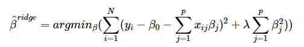
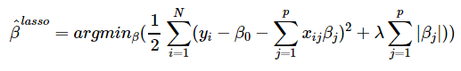

# Cancer Data
A repo for code used to recreate results seen in The Elements of Statistical Learning. We showcase Ridge Regression and the Elastic Net.

To view the html file of the rendered file:  https://robby955.github.io/CancerData/prostatedata.html

The main goal of this document is to provide a refresher on regression methods and model selection using statistical learning. This guide also introduces several useful R functions that are common in Machine Learning.

A second goal of this document is to provide an R code companion of the ‘prostate cancer’ dataset that is introduced in The Elements of Statistical Learning (ESL). The Dataset can be obtained here: https://web.stanford.edu/~hastie/ElemStatLearn/data.html.

The original dataset comes from a study by Stamey et al. (1989)

I created this image using the pairs function in R. It mirrors the image shown in Elements of Statistical Learning.

We also obtain estimates using Ridge Regression:

And we obtain estimates using the Lasso:

